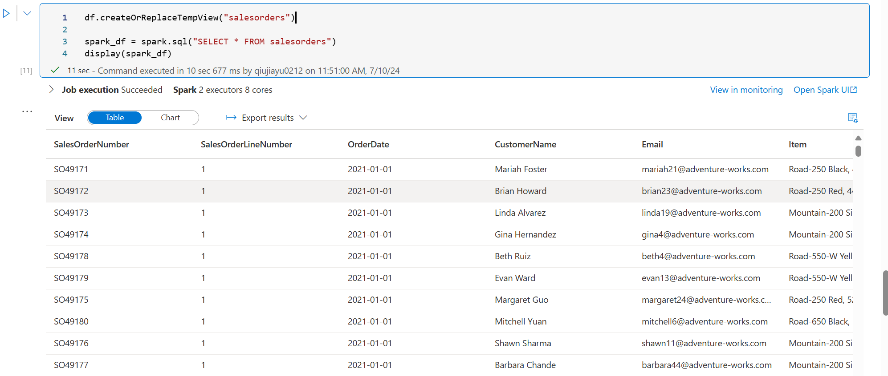
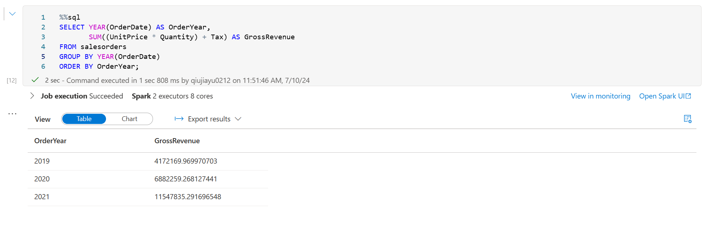
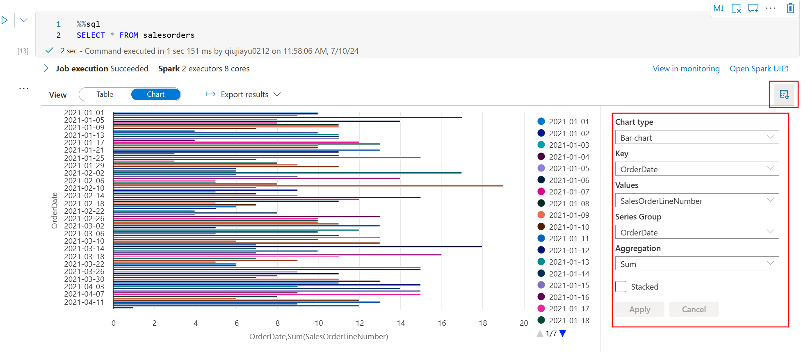
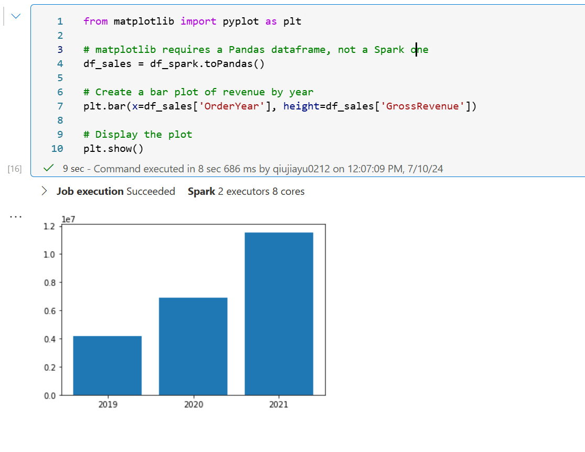
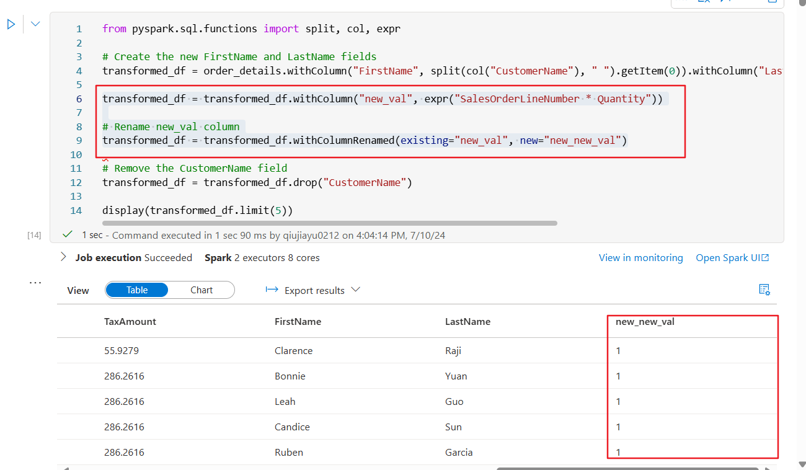

# Spark Pool

## 1 Magic SQL





After we have created a view using PySpark, we can use `SELECT` directly using `$$sql` Magic Cell. Awesome!


## 2 Chat



We can use `view option` to set chat type and get the chat we want.


## 3 matplotlib



```python
from matplotlib import pyplot as plt

# matplotlib requires a Pandas dataframe, not a Spark one
df_sales = df_spark.toPandas()  # convert spark dataframe to pandas dataframe

# Create a bar plot of revenue by year
plt.bar(x=df_sales['OrderYear'], height=df_sales['GrossRevenue'])

# Display the plot
plt.show()
```

We can use `matplotlib` in Synapse just like in `jupyter`.

## 4 Data Transformation

### 4.1 File path

```python
# Full paht in Datalake is : files/data/*.csv
order_details = spark.read.csv('/data/*.csv', header=True, inferSchema=True)
display(order_details.limit(5))
```


### 4.2 Transform the data structure

```python
from pyspark.sql.functions import split, col

# Create the new FirstName and LastName fields
transformed_df = order_details.withColumn("FirstName", split(col("CustomerName"), " ").getItem(0)).withColumn("LastName", split(col("CustomerName"), " ").getItem(1))

transformed_df = transformed_df.withColumn("new_val", expr("SalesOrderLineNumber * Quantity"))

# Rename new_val column
transformed_df = transformed_df.withColumnRenamed(existing="new_val", new="new_new_val")

# Remove the CustomerName field
transformed_df = transformed_df.drop("CustomerName")

display(transformed_df.limit(5))
```




To extend the demo, I added a new column `new_val` and `Rename` it to `new_new_val`


### 4.3 Save & Read data

- save data without partition

```python
transformed_df.write.mode("overwrite").parquet('/transformed_data/orders.parquet')
print ("Transformed data saved!")
```

- save data with partition

```python
from pyspark.sql.functions import year, month, col

dated_df = transformed_df.withColumn("Year", year(col("OrderDate"))).withColumn("Month", month(col("OrderDate")))
display(dated_df.limit(5))
dated_df.write.partitionBy("Year","Month").mode("overwrite").parquet("/partitioned_data")
print ("Transformed data saved!")
```

- Load Data

```python
# load data with partition
orders_2020 = spark.read.parquet('/partitioned_data/Year=2020/Month=*')
display(orders_2020.limit(5))
```


### 4.4 Performing SQL & Spark SQL

```python
# declare table name is `sales_orders` and save it into datalake
order_details.write.saveAsTable('sales_orders', format='parquet', mode='overwrite', path='/sales_orders_table')
```

#### 4.4.1 Spark SQL

```python
sql_transform = spark.sql("SELECT *, YEAR(OrderDate) AS Year, MONTH(OrderDate) AS Month FROM sales_orders")
display(sql_transform.limit(5))
sql_transform.write.partitionBy("Year","Month").saveAsTable('transformed_orders', format='parquet', mode='overwrite', path='/transformed_orders_table')
```

#### 4.4.2 Magic SQL

- SELECT

```sql
%%sql

SELECT * FROM transformed_orders
WHERE Year = 2021
    AND Month = 1
```

- DELETE

```sql
%%sql

DROP TABLE transformed_orders;
DROP TABLE sales_orders;
```

