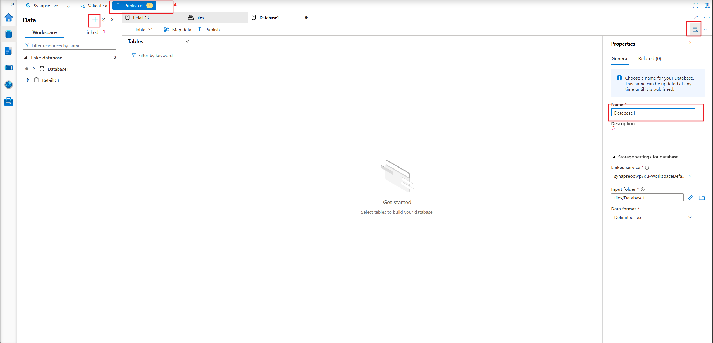

# How to create Data Lake

# 1 Modify container permissions

Switch to **Entra User Account**

# 2 Create a database

- Open Synapse Studio
- Data → WorkLoad → + Lake Database

- In Lake Database, +table
- Go to files, + folder, upload files

# 3 Query

SELECT as you would in the MySQL or other relational database.

