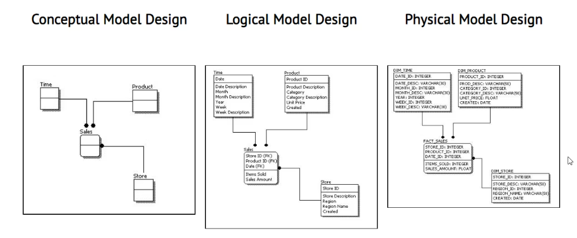
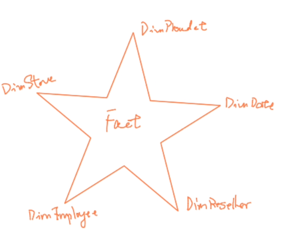
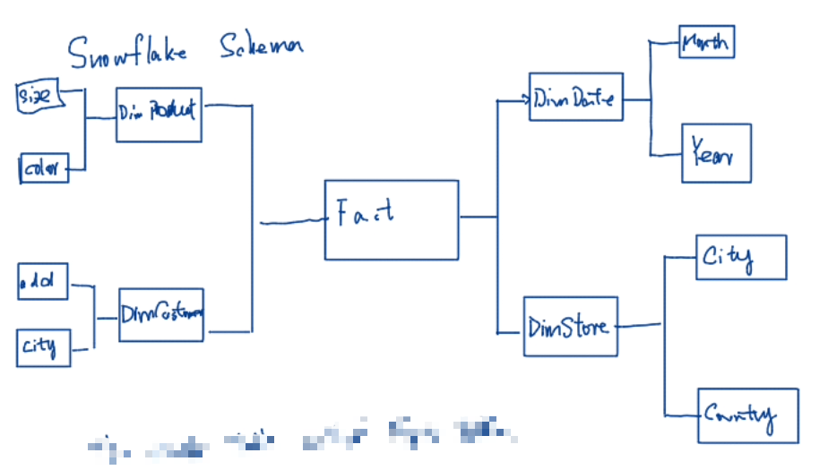

# Data Schema

## 1 Three common types of Data Schema

## 1.1 Conceptual Schema

A conceptual schema does not go into detail about specific objects such as tables, views, and columns; instead, it focuses on abstract concepts and how they relate to one another.

### Key Characteristics:

- **abstract representation**: focusing on what data is stored and how it is related, rather than how it is stored.
- **Entity-Relationship Model**: It often uses an Entity-Relationship (ER) diagram to represent the data model. Entities represent objects or things of interest, relationships depict how entities are related, and attributes describe properties of entities.

### Steps in Creating a Conceptual Schema

1. **Requirement Analysis**:
   - Gather and analyze business requirements through stakeholder interviews, document analysis, and use case scenarios.
2. **Identify Entities**:
   - Identify the key entities that represent significant objects or concepts within the business domain.
3. **Define Attributes**:
   - Determine the attributes that describe each entity, capturing relevant details and properties.
4. **Establish Relationships**:
   - Define the relationships between entities, including cardinality and participation constraints.
5. **Create ER Diagram**:
   - Visualize the entities, attributes, and relationships in an ER diagram to provide a graphical representation of the conceptual schema.

### Conclusion

A conceptual schema is an essential step in database design, providing an abstract, high-level representation of an organization's data and its interrelationships. It ensures that the database design aligns with business requirements and provides a clear communication tool for stakeholders. Understanding and effectively creating conceptual schemas are crucial skills for data architects, database designers, and data engineers.

## 1.2. Logical Schema

A logical schema outlines the structure and relationships between various entities within a database, as well as how data is stored in the tables. A logical schema is a detailed, logical representation of the data structure in a database. It is an intermediate step between the high-level conceptual schema and the low-level physical schema.

### Key Characteristics:

- DBMS-Specific: Tailored to a specific type of DBMS (e.g., relational, object-oriented) but still independent of physical storage considerations.
- **Detailed Structure**: Includes tables, columns, data types, primary keys, foreign keys, indexes, and constraints.
- **Normalization**: Ensures data is organized efficiently, typically normalized to reduce redundancy and improve data integrity.(1NF, 2NF, 3NF)
- **Foundation for Physical Design**: Serves as a blueprint for creating the physical schema, which includes actual data storage details like files and indexes.

### Steps in Creating a Logical Schema

1. **Refine Conceptual Schema**:
   - Start with the conceptual schema and refine it by adding details such as data types, primary keys, and foreign keys.
2. **Normalize Data**:
   - Apply normalization rules to organize data efficiently and reduce redundancy.
3. **Define Tables and Columns**:
   - Specify the tables, columns, and data types based on the refined conceptual schema.
4. **Establish Relationships**:
   - Define the relationships between tables using primary keys and foreign keys.
5. **Specify Constraints**:
   - Add constraints to enforce data integrity and business rules.
6. **Design Indexes**:
   - Create indexes to improve query performance based on usage patterns.

### Conclusion

A logical schema is a crucial step in database design that provides a detailed and DBMS-specific representation of the data structure. It builds on the high-level conceptual schema and **serves as a blueprint for the physical implementation of the database**. Understanding and effectively designing a logical schema are essential skills for data engineers, database designers, and developers to ensure efficient, reliable, and scalable database systems.

## 1.3 Physical Schema

A physical schema is the **lowest** level of abstraction in the database design process. It deals with the physical storage of data, detailing how the logical data structures defined in the logical schema are implemented in the database system. This includes **the storage format, data locations, access methods, and performance optimization techniques**.

### Key Characteristics

- **Storage Details**: Defines how data is physically stored on disk, including file formats, storage locations, and data partitioning.
- **DBMS-Specific**: Tailored to the specific database management system (DBMS) being used, leveraging its features and optimization techniques.
- **Performance Optimization**: Focuses on performance aspects such as indexing, partitioning, and clustering to ensure efficient data retrieval and manipulation.
- **Implementation Details**: Includes specifics of data storage, such as page sizes, buffer management, and storage engines.

### Steps in Creating a Physical Schema

1. **Analyze Logical Schema**:
   - Start with the logical schema to understand the data structures and relationships.
2. **Determine Storage Requirements**:
   - Assess the volume of data, access patterns, and performance requirements.
3. **Design Storage Layout**:
   - Define the files, filegroups, and tablespaces to store the data.
4. **Create Indexes**:
   - Define indexes to optimize query performance based on access patterns.
5. **Partition Data**:
   - Divide large tables into partitions to improve performance and manageability.
6. **Optimize Access Methods**:
   - Select appropriate access methods and storage engines for the data.
7. **Implement Constraints and Security**:
   - Apply constraints and security measures to ensure data integrity and protection.

### Conclusion

The physical schema is a critical step in the database design process that ensures the efficient and effective storage, retrieval, and manipulation of data. It translates the logical schema **into concrete storage structures tailored to the specific DBMS, optimizing performance and scalability**. Understanding and designing a robust physical schema are essential skills for data engineers and database administrators to ensure the successful implementation of a database system.

# 2 Star Schema VS Snowflake Schema

## 2.1 Star Schema

**Structure**:

- **Central Fact Table**: Contains the main data, usually numerical measures (e.g., sales amount, order quantity).
- **Dimension Tables**: Surround the fact table, containing descriptive attributes related to the measures (e.g., date, product, customer).

**Design**:

- **Denormalized**: Dimension tables are typically denormalized, meaning they contain redundant data to simplify and speed up queries.
- **Simple Relationships**: Dimension tables are directly connected to the fact table.

**Advantages**:

- **Simplicity**: Easier to design and understand.
- **Query Performance**: Faster query performance due to fewer joins.
- **User-Friendly**: Easier for business users to navigate and generate reports.

**Disadvantages**:

- **Redundancy**: Redundant data can lead to increased storage requirements.
- **Maintenance**: Updates and inserts can be more complex due to redundancy.

**When to Use**:

- When query performance is critical and you need fast, straightforward queries.
- When the data warehouse is relatively small to medium in size.
- When simplicity and ease of use for business users is a priority.

### Example

In my project, the fact table logs data about ships sailing. The dimension tables are: dim ship properties, dim port properties, and dim dock properties.

## 2.2 Snowflake Schema

