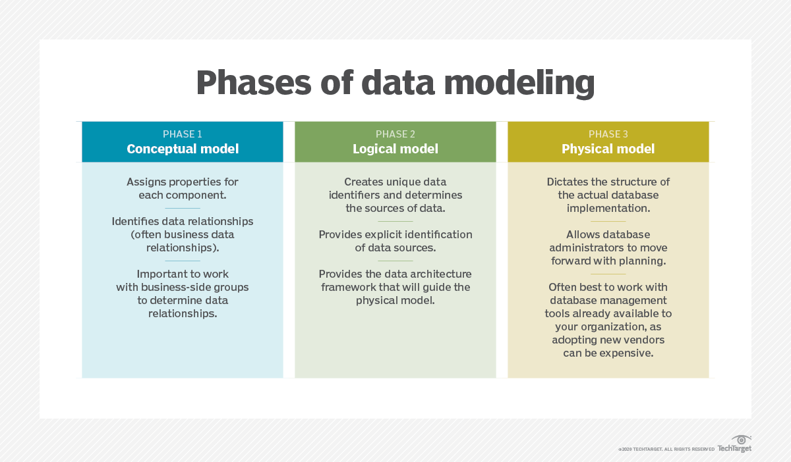

Data modeling is a crucial aspect of data engineering. It involves designing the structure and organization of data to ensure it is efficient, scalable, and supports the needs of the business. Here’s a detailed overview to help you understand data modeling better:

### What is Data Modeling?

Data modeling is the process of creating a visual representation of the data structures and relationships within a database or data system. It helps in defining how data is stored, organized, and accessed, ensuring that data is consistent, accurate, and usable for analysis and decision-making.

### Key Concepts in Data Modeling

1. **Entities and Attributes**:
   - **Entity**: An object or concept about which data is stored (e.g., Customer, Order).
   - **Attribute**: A property or characteristic of an entity (e.g., Customer Name, Order Date).
2. **Relationships**:
   - The connections between entities. Relationships can be one-to-one, one-to-many, or many-to-many.
3. **Keys**:
   - **Primary Key**: A unique identifier for each record in a table.
   - **Foreign Key**: A field in one table that uniquely identifies a row in another table, establishing a link between the tables.
4. **Normalization**:
   - The process of organizing data to reduce redundancy and improve data integrity. Normal forms (1NF, 2NF, 3NF, etc.) define specific rules for normalization.
5. **Schema**:
   - The blueprint of how data is structured in the database, including tables, columns, data types, and relationships.

### Types of Data Models

1. **Conceptual Data Model**:
   - A high-level model that defines the scope and structure of data. It is typically used for communication with stakeholders.
   - **Example**: Entity-Relationship Diagram (ERD).
2. **Logical Data Model**:
   - A detailed model that specifies the data entities, their attributes, and relationships without considering how the data will be physically stored.
   - **Example**: Tables and fields in a relational database.
3. **Physical Data Model**:
   - A detailed model that defines how data is physically stored in the database, including indexing, partitioning, and storage details.
   - **Example**: SQL scripts to create tables, indexes, and constraints.

### Common Data Modelling Tools

1. **ER/Studio**: For creating ER diagrams and logical data models.
2. **Microsoft SQL Server Management Studio (SSMS)**: For designing and managing databases.
3. **Oracle SQL Developer**: For database design and modeling.
4. **MySQL Workbench**: For visual data modeling of MySQL databases.
5. **Lucidchart**: A web-based tool for creating ER diagrams and other data models.

### Steps in Data Modelling

1. **Requirement Gathering**:
   - Understand business requirements and data needs.
2. **Conceptual Design**:
   - Create a high-level model with entities and relationships.
3. **Logical Design**:
   - Develop a detailed model with tables, columns, and keys.
4. **Physical Design**:
   - Finalize the model with physical storage details, indexing, and partitioning.
5. **Review and Iterate**:
   - Validate the model with stakeholders and iterate based on feedback.

### Example

Let’s consider a simple example of an e-commerce system:

- **Entities**: Customer, Order, Product
- **Attributes**:
  - Customer: CustomerID (PK), Name, Email
  - Order: OrderID (PK), OrderDate, CustomerID (FK)
  - Product: ProductID (PK), ProductName, Price
- **Relationships**:
  - A Customer can place many Orders (one-to-many).
  - An Order can include many Products (many-to-many), requiring a junction table (OrderDetails) with OrderID and ProductID.

### Summary

Data modeling is essential for building efficient, scalable, and maintainable data systems. It ensures that data is well-organized, relationships are clear, and data integrity is maintained. Understanding data modeling concepts and techniques will greatly enhance your ability as a data engineer.